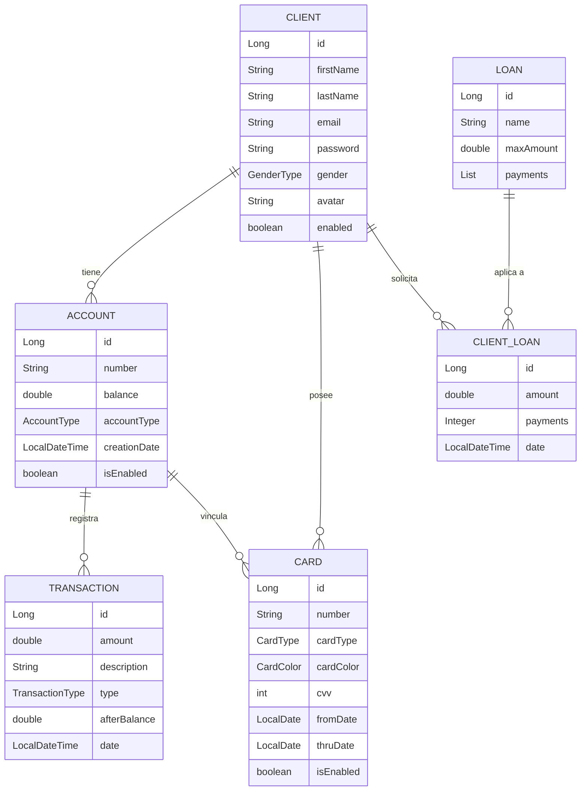

# HomeBanking Java

> Sistema de banca online full-stack construido con Spring Boot y Vue.js


---

## Descripcion

**HomeBanking Java** es una plataforma de banca online simulada desarrollada como proyecto de portafolio. Representa el sistema de un banco ficticio llamado **Mindhub Brothers Bank**, donde los clientes pueden registrarse, gestionar cuentas bancarias, realizar transferencias, administrar tarjetas y solicitar prestamos.

El proyecto implementa una arquitectura en capas completa: API REST con Spring Boot en el backend, persistencia en PostgreSQL con JPA/Hibernate, seguridad con Spring Security basada en sesiones, y un frontend interactivo construido con Vue.js 3 y Bootstrap 5 sin necesidad de un bundler.

---

## Funcionalidades

**Autenticacion y usuarios**
- Registro de clientes con nombre, apellido, email, contraseña, genero y avatar seleccionable
- Login y logout basado en sesion HTTP (cookie `JSESSIONID`)
- Dos roles: `CLIENT` (usuarios normales) y `ADMIN` (acceso completo via `admin@admin.com`)
- Cuenta de ahorro creada automaticamente al registrarse

**Cuentas bancarias**
- Tipos de cuenta: `CHECKING` (corriente) y `SAVINGS` (ahorro)
- Maximo 3 cuentas activas por cliente
- Numeracion automatica en formato `VIN-XXXXXXXX`
- Desactivacion logica (soft delete) — requiere saldo en cero

**Transferencias**
- Transferencias entre cuentas con operaciones atomicas
- Se registra un par de transacciones `DEBIT`/`CREDIT` por cada operacion
- Validaciones: fondos insuficientes, cuenta origen no propia, cuenta inexistente, monto cero

**Tarjetas**
- Tipos: `DEBIT` y `CREDIT`
- Colores: `GOLD`, `SILVER`, `TITANIUM`
- Vinculadas a una cuenta especifica del cliente
- Generacion automatica de numero de 16 digitos, CVV de 3 digitos y vencimiento a 5 anos
- Maximo 2 tarjetas activas del mismo tipo por cuenta; colores no repetibles por tipo

**Prestamos**
- Productos de prestamo configurables con monto maximo y opciones de cuotas
- Calculo de interes segun plazo: 6c → 8%, 12c → 10%, 24c → 15%, 36c → 18%, 48c → 20%, 60c → 25%
- Un cliente no puede tener dos prestamos del mismo tipo de forma simultanea
- El monto aprobado se acredita como transaccion en la cuenta de destino

**Pagos con tarjeta**
- Pago a comercios externos (`POST /api/pay`) — endpoint publico para integracion ecommerce
- Pago de cuotas de prestamo (`POST /api/pay/loan`)
- Validaciones: tarjeta activa, no vencida, CVV correcto, saldo suficiente

**Panel de administracion**
- Acceso exclusivo para `admin@admin.com`
- Visualizacion y gestion de todos los clientes del sistema

---

## Stack Tecnologico

| Capa | Tecnologia |
|---|---|
| Lenguaje | Java 11 |
| Framework backend | Spring Boot 2.7.5 |
| Persistencia | Spring Data JPA + Hibernate |
| Base de datos | PostgreSQL 12+ |
| Seguridad | Spring Security (sesiones HTTP) |
| Build tool | Gradle 7.5.1 |
| Frontend | Vue.js 3 (via CDN, sin bundler) |
| UI Kit | Bootstrap 5.2.3 + MDB UI Kit 6.0.1 |
| Iconos | Font Awesome 6.0.0, Bootstrap Icons 1.10.2 |
| Animaciones | Animate.css 4.1.1 |
| Contenedor | Docker (`gradle:7.5.1-jdk11-alpine`) |

---

## Arquitectura

### Estructura del proyecto

```
src/main/java/com/mindhub/homebanking/
├── Controllers/           # REST controllers por dominio
│   ├── ClientController.java
│   ├── AccountController.java
│   ├── TransactionController.java
│   ├── CardController.java
│   ├── LoanController.java
│   └── PaymentController.java
├── configurations/        # Configuracion de Spring Security
│   ├── WebAuthorization.java   # Reglas de acceso por endpoint
│   └── WebAutentication.java   # Proveedor de autenticacion y roles
├── models/                # Entidades JPA
│   ├── Client.java
│   ├── Account.java
│   ├── Transaction.java
│   ├── Card.java
│   ├── Loan.java
│   ├── ClientLoan.java
│   └── [enums: AccountType, CardType, CardColor, TransactionType, GenderType]
├── DTOs/                  # Objetos de transferencia de datos
│   ├── ClientDTO.java
│   ├── AccountDTO.java
│   ├── TransactionDTO.java
│   ├── CardDTO.java
│   ├── LoanDTO.java
│   ├── ClientLoanDTO.java
│   ├── LoanAplicationDTO.java
│   └── PayDTO.java
├── service/               # Interfaces de servicio + implementaciones
│   ├── [InterfaceService].java
│   └── implement/[ServiceImplementation].java
├── repositories/          # Spring Data JPA repositories
├── Utils/                 # Utilidades (numeros aleatorios, calculo de interes)
└── HomebankingApplication.java
```

Frontend (servido como recursos estaticos):

```
src/main/resources/static/web/
├── Index.html / Index.js           # Landing page con formulario de login
├── registration.html               # Registro de nuevos clientes
├── accounts.html / accounts.js     # Panel principal — listado de cuentas
├── account.html / account.js       # Detalle de cuenta y transacciones
├── cards.html / cards.js           # Vista de tarjetas del cliente
├── create-cards.html               # Creacion de nueva tarjeta
├── transactions.html               # Historial de transacciones
├── loan-application.html           # Solicitud de prestamos
├── pay.html / pay.js               # Pagos con tarjeta
├── criptocurrencies.html           # Pagina informativa de criptomonedas
└── admin.html / admin.js           # Panel de administracion
```

### Modelo de datos



---

## API REST

Todos los endpoints tienen base `/api`. La autenticacion se realiza con `POST /api/login` y se mantiene mediante cookie de sesion `JSESSIONID`.

### Autenticacion

| Metodo | Endpoint | Descripcion | Acceso |
|---|---|---|---|
| `POST` | `/api/login` | Iniciar sesion (`email`, `password` como form params) | Publico |
| `POST` | `/api/logout` | Cerrar sesion y eliminar cookie | `CLIENT` |

### Clientes

| Metodo | Endpoint | Descripcion | Acceso |
|---|---|---|---|
| `POST` | `/api/clients` | Registrar nuevo cliente | Publico |
| `GET` | `/api/clients/current` | Obtener datos del cliente autenticado | `CLIENT` |
| `GET` | `/api/clients` | Listar todos los clientes | `ADMIN` |
| `GET` | `/api/clients/{id}` | Obtener cliente por ID | `ADMIN` |

### Cuentas

| Metodo | Endpoint | Descripcion | Acceso |
|---|---|---|---|
| `POST` | `/api/clients/current/accounts` | Crear cuenta (`accountType`: `CHECKING` o `SAVINGS`) | `CLIENT` |
| `POST` | `/api/clients/current/accounts/delete` | Desactivar cuenta (`accountId`) | `CLIENT` |
| `GET` | `/api/accounts` | Listar todas las cuentas | `ADMIN` |
| `GET` | `/api/accounts/{id}` | Obtener cuenta por ID | `ADMIN` |

### Transferencias

| Metodo | Endpoint | Descripcion | Acceso |
|---|---|---|---|
| `POST` | `/api/clients/current/transaction` | Realizar transferencia | `CLIENT` |
| `GET` | `/api/transaction` | Listar todas las transacciones | `ADMIN` |

Parametros para transferencia: `amount`, `originNumber`, `destNumber`, `descr`

### Tarjetas

| Metodo | Endpoint | Descripcion | Acceso |
|---|---|---|---|
| `POST` | `/api/clients/current/cards` | Crear tarjeta (`cardType`, `cardColor`, `id` de cuenta) | `CLIENT` |
| `POST` | `/api/clients/current/cards/delete` | Desactivar tarjeta (`cardId`) | `CLIENT` |
| `GET` | `/api/clients/cards` | Listar todas las tarjetas | `ADMIN` |

### Prestamos

| Metodo | Endpoint | Descripcion | Acceso |
|---|---|---|---|
| `GET` | `/api/loans` | Listar productos de prestamo disponibles | `CLIENT` |
| `POST` | `/api/loans` | Solicitar un prestamo (body JSON) | `CLIENT` |

Body para solicitud de prestamo:

```json
{
  "id": 1,
  "amount": 50000.0,
  "payments": 12,
  "destNumber": "VIN-12345678"
}
```

### Pagos

| Metodo | Endpoint | Descripcion | Acceso |
|---|---|---|---|
| `POST` | `/api/pay` | Pago con tarjeta a comercio externo | Publico |
| `POST` | `/api/pay/loan` | Pago de cuota de prestamo | Publico |

Body para pagos:

```json
{
  "cardNumber": "1234-5678-9012-3456",
  "cvv": 123,
  "amount": 1500.0,
  "description": "Compra en tienda online"
}
```

---

## Seguridad

La autenticacion se basa en sesiones HTTP gestionadas por Spring Security. No se utiliza JWT; la sesion se identifica mediante la cookie `JSESSIONID` que se elimina al hacer logout.

- Contrasenas cifradas con **BCrypt** via `PasswordEncoderFactories.createDelegatingPasswordEncoder()`
- CSRF deshabilitado (adecuado para API REST consumida desde mismo origen)
- CORS habilitado globalmente con `applyPermitDefaultValues()`
- El rol `ADMIN` se asigna exclusivamente al email `admin@admin.com` en `WebAutentication.java`
- El registro de nuevos clientes y el endpoint `/api/pay` son publicos (sin autenticacion)

---

## Instalacion y Configuracion

### Requisitos previos

- Java 11 o superior
- PostgreSQL 12 o superior
- Gradle 7.5.1 (o usar el wrapper incluido `./gradlew`)
- Docker (opcional)

### Variables de entorno

| Variable | Descripcion | Valor por defecto |
|---|---|---|
| `DB_HOST` | Host del servidor PostgreSQL | `100.98.188.69` |
| `DB_USER` | Usuario de PostgreSQL | (requerido) |
| `DB_PASSWORD` | Contrasena de PostgreSQL | (requerido) |

> En entornos locales, usar `DB_HOST=localhost`.

### Ejecucion local

```bash
# 1. Clonar el repositorio
git clone https://github.com/<tu-usuario>/homebanking-java.git
cd homebanking-java

# 2. Crear la base de datos en PostgreSQL
psql -U postgres -c "CREATE DATABASE mhbank;"

# 3. Configurar variables de entorno
export DB_HOST=localhost
export DB_USER=tu_usuario
export DB_PASSWORD=tu_password

# 4. Compilar y ejecutar
./gradlew bootRun
```

La aplicacion estara disponible en `http://localhost:8080`.  
La pagina de inicio se encuentra en `http://localhost:8080/web/Index.html`.

### Ejecucion con Docker

```bash
# Construir la imagen
docker build -t homebanking-java .

# Ejecutar (conectando a PostgreSQL en el host)
docker run -p 8080:8080 \
  -e DB_HOST=host.docker.internal \
  -e DB_USER=tu_usuario \
  -e DB_PASSWORD=tu_password \
  homebanking-java
```

### Credenciales de prueba

El usuario administrador es `admin@admin.com`. Su contrasena debe insertarse directamente en la base de datos con hash BCrypt, ya que no existe un script de datos semilla. Se puede generar el hash con:

```bash
# Ejemplo usando htpasswd (o cualquier herramienta BCrypt)
htpasswd -bnBC 10 "" tu_password | tr -d ':\n'
```

Luego actualizar en la base de datos:

```sql
UPDATE client SET password = '{bcrypt}$2a$10$...' WHERE email = 'admin@admin.com';
```

---

## Uso

Flujo basico para probar la aplicacion:

1. Acceder a `http://localhost:8080/web/registration.html` y crear una cuenta nueva
2. Iniciar sesion desde `http://localhost:8080/web/Index.html`
3. Desde el panel de cuentas, crear una cuenta `CHECKING` o `SAVINGS` adicional
4. Desde la pagina de prestamos, solicitar un prestamo seleccionando monto y cuotas
5. Realizar una transferencia entre dos cuentas propias ingresando monto y numeros de cuenta

Para probar el flujo de administracion, iniciar sesion con `admin@admin.com` y acceder a `http://localhost:8080/web/admin.html`.

---

## Decisiones Tecnicas y Aprendizajes

- **Arquitectura en capas:** separacion explicita entre Controllers, Services, Repositories y DTOs permite seguir principios SOLID y facilita el testing independiente de cada capa.

- **Soft delete:** las cuentas y tarjetas desactivadas no se eliminan fisicamente de la base de datos. Esto preserva el historial de transacciones y permite auditar operaciones pasadas.

- **Transacciones atomicas:** las transferencias estan anotadas con `@Transactional`. Si falla el credito en la cuenta de destino, el debito en la cuenta de origen se revierte automaticamente.

- **Logica de negocio desacoplada del controlador:** el calculo de tasas de interes reside en `Utils/Utilities.java`, separado del controlador y del servicio. Esto facilita cambiar la politica de tasas sin tocar la logica de aplicacion de prestamos.

- **DTOs para la capa de presentacion:** los DTOs filtran datos sensibles (como contrasenas) y permiten controlar exactamente que informacion se expone en cada endpoint, sin acoplar la API al modelo de persistencia.

---

## Posibles Mejoras Futuras

- Migracion del frontend a una SPA dedicada con Vue CLI o Vite para mejor experiencia de desarrollo y build optimizado
- Reemplazar autenticacion por sesion con **JWT** para mayor escalabilidad en entornos distribuidos
- Agregar pipeline de CI/CD con GitHub Actions + publicacion de imagen en Docker Hub
- Cobertura de tests unitarios e integracion con **JUnit 5** y **MockMvc**
- Historial de transacciones paginado con filtros por fecha, tipo y monto

---

## Licencia

Distribuido bajo la licencia MIT. Ver `LICENSE` para mas informacion.

---

## Autor

Desarrollado por **Franco Brizzio**
